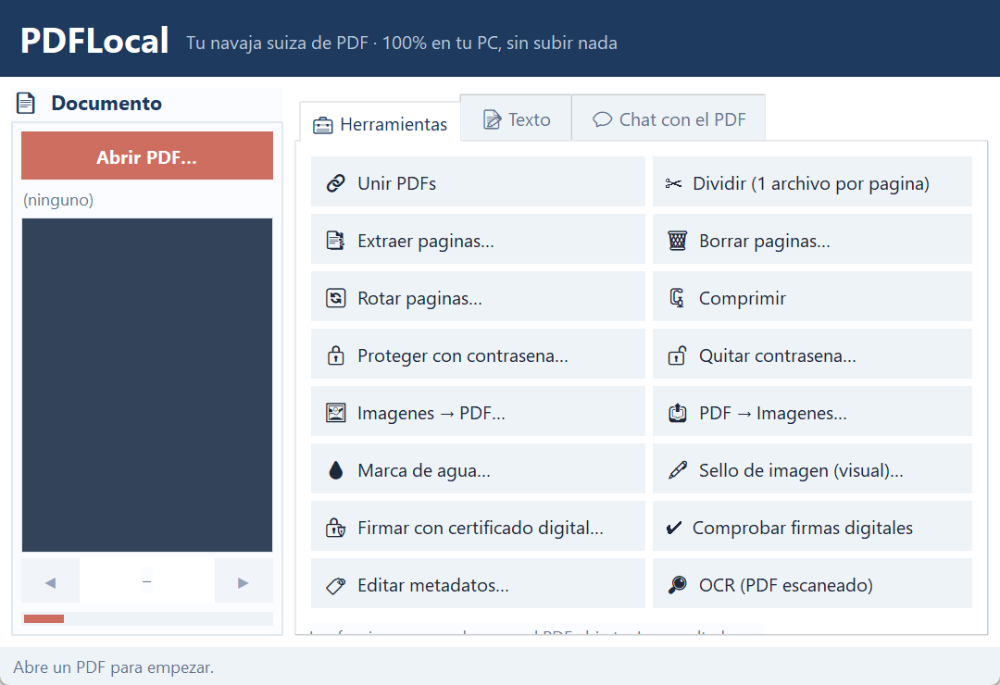

# PDFLocal

The full PDF toolbox for Windows: merge, split, compress, sign, OCR and chat with your documents — no uploads.

**Free · Open source (MIT) · 100% local — nothing ever leaves your PC · No accounts, no limits, no watermarks**

> 🇪🇸 ¿Prefieres leerlo en español? → **[README en español](README.es.md)**

## Features

- Merge, split, reorder and **compress** PDFs
- **Digital signature** with your own certificate
- OCR for scanned documents
- Ask questions about a document with optional **local AI**
- 100% offline: your files never leave your PC

## Download (Windows 10/11)

### ➡️ [**Download PDFLocal (installer .exe)**](https://github.com/Octonove/pdflocal/releases/latest/download/PDFLocal-Setup.exe)

Direct download, no sign-up. If Windows shows *"Windows protected your PC"* (normal for new unsigned apps): click **More info → Run anyway**. Installs without administrator rights.

> ⭐ **If PDFLocal is useful to you, a star on GitHub is the best way to support it — it costs nothing and helps a lot.**

## More free local-first tools

Every tool in this family follows the same rules: free, open source, and nothing leaves your PC.

| Tool | What it does |
|---|---|
| [CapturaPro](https://github.com/Octonove/capturapro) | Screenshots, GIFs and screen recordings for Windows — annotated, watermark-free, 100% local. |
| [TranscriptorIA](https://github.com/Octonove/transcriptor-ia) | Audio & video to text and .srt subtitles with local Whisper AI — free, private, unlimited. |
| [CajaPDF](https://github.com/Octonove/cajapdf) | The tiny PDF utility: merge, split and compress — free, offline, no accounts. |
| [CapturaStudio](https://github.com/Octonove/capturastudio) | An OBS-style recording & streaming studio with local AI superpowers — record, stream, auto-edit. |
| [GuiaClick](https://github.com/Octonove/guiaclick) | Record your clicks, get a step-by-step guide — annotated screenshots, blur, PDF/HTML export. Like Scribe, but local. |
| [ActaLocal](https://github.com/Octonove/actalocal) | Meetings → minutes: local Whisper transcription plus AI summary, decisions and action items. |
| [AutoEscritorio](https://github.com/Octonove/autoescritorio) | Trigger→action automation for Windows: watch folders, hotkeys, USB, clipboard — simple and local. |
| [BalanceLocal](https://github.com/Octonove/balancelocal) | Your work Wrapped: where your time actually goes, as shareable cards, a PDF report and a mini-video. |
| [CajaNegra](https://github.com/Octonove/cajanegra) | A dashcam for your PC: the last minutes of your screen, one hotkey away from a perfect incident report. |
| [FichajeLocal](https://github.com/Octonove/fichajelocal) | A local time-clock kiosk for small business: PIN check-in, tamper-evident records, accountant-ready reports. |
| [ITVLocal](https://github.com/Octonove/itvlocal) | An MOT-style inspection for your PC: 1–3 minutes, a 0–10 score and a PDF certificate. Inspects, never modifies. |
| [SonarArchivo](https://github.com/Octonove/sonararchivo) | Find files by what's INSIDE them: local full-text search over your messy folders and old drives. |

Also: **[CRBRO](https://github.com/Octonove/crbro-memory)** — persistent neural memory for AI agents (MCP server).

## License

[MIT](LICENSE) — see also [THIRD-PARTY-NOTICES.md](THIRD-PARTY-NOTICES.md) where present.
